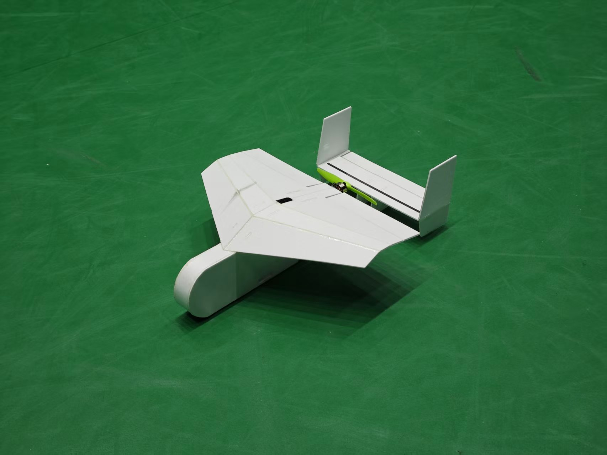

# Minihawk
Minihawk is a family of model aircraft with narrow wingspans, designed specifically for indoor FPV flight.

**All engineering source files (.dxf, .step, .stl) of this project are licensed under the CERN-OHL-S-2.0 license, unless otherwise stated within the specific file.**

# Common Minihawk 2

This is a CFD optimized version of minihawk using 2mm foam boards (vector board, depron, etc.) and 3D printed servo horns. Laser engraver friendly dxf files are provided. It could reach a battery life of 40 minutes with a 1000mah battery. Additional materials includes :  

1. 1104/1503 brushless motor, 3-4 inches propeller and compatible ESC.  
2. One 5g servo for aileron and one 2.5g servo for elevator.  
3. 300-1000mAh2s LiPo battery.  
4. 2mm carbon fiber rod (230mm x 2), 1mm steel wire.