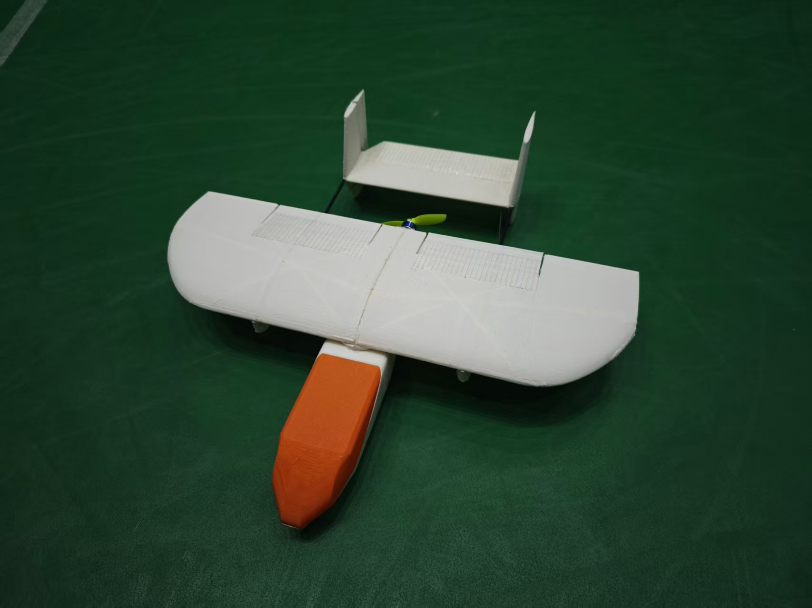

# Minihawk
Minihawk is a family of model aircraft with narrow wingspans, designed specifically for indoor FPV flight.

**All engineering source files (.dxf, .step, .stl) of this project are licensed under the CERN-OHL-S-2.0 license, unless otherwise stated within the specific file.**

# Minihawk Printed

This is a 3D printed version using PLA-Aero wings and body and pla motor plate and servo horns. The ideal takeoff weight is below 150g. Additional materials includes :  

1. 1104 brushless motor, 3 inches propeller and compatible ESC.  
2. Two 2.5g servos and a 4.3g servo.  
3. 300mAh2s LiPo battery.  
4. 3mm carbon fiber rods, 1mm steel wire.