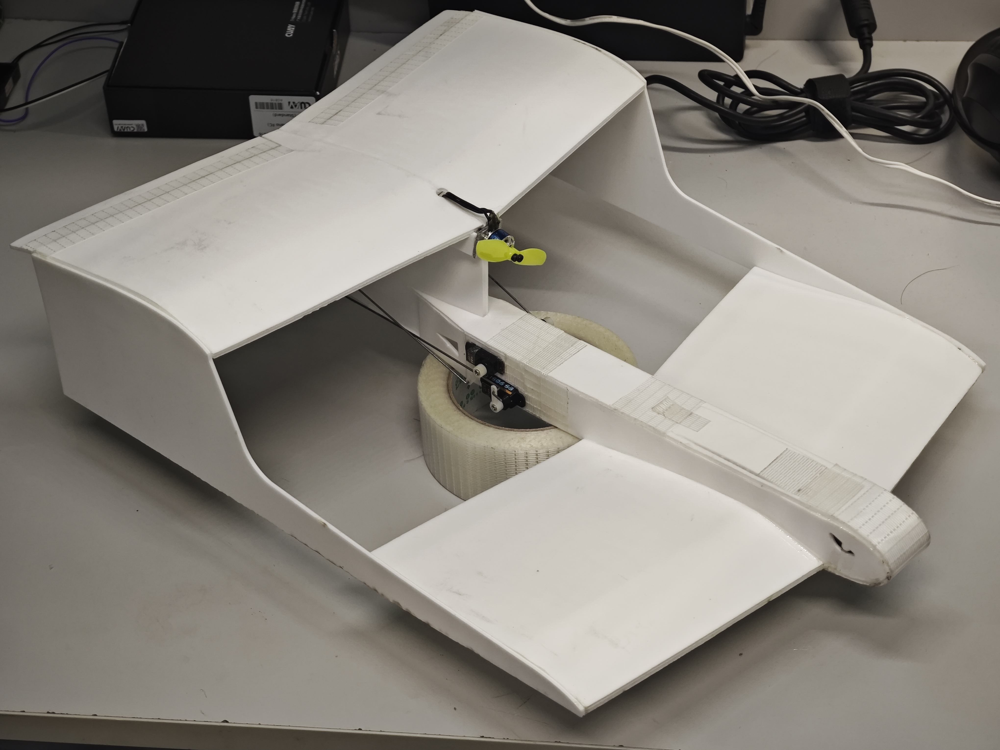

# Minihawk
Minihawk is a family of model aircraft with narrow wingspans, designed specifically for indoor FPV flight.

**All engineering source files (.dxf, .step, .stl) of this project are licensed under the CERN-OHL-S-2.0 license, unless otherwise stated within the specific file.**

# Minihawk Tandem

This is a tandem version using 2mm foam boards (vector board, depron, etc.) and 3D printed servo horns. Laser engraver friendly dxf files are provided. A step file is provided to help assembly. It features ability to fly in small places(15m x 15m). Additional materials includes :  

1. 1104 brushless motor, 3 inches propeller and compatible ESC.  
2. Three 2.5g servos.  
3. 300mAh2s LiPo battery.  
4. 1mm steel wire.